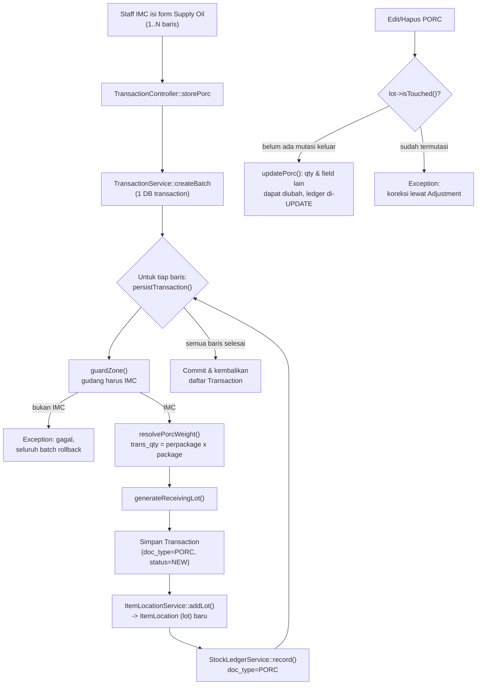
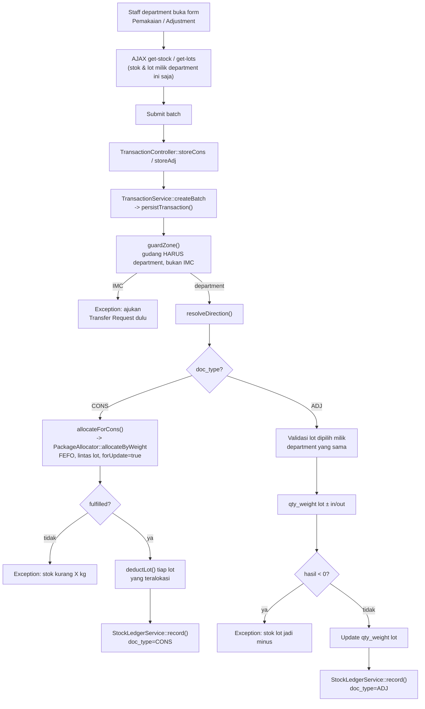
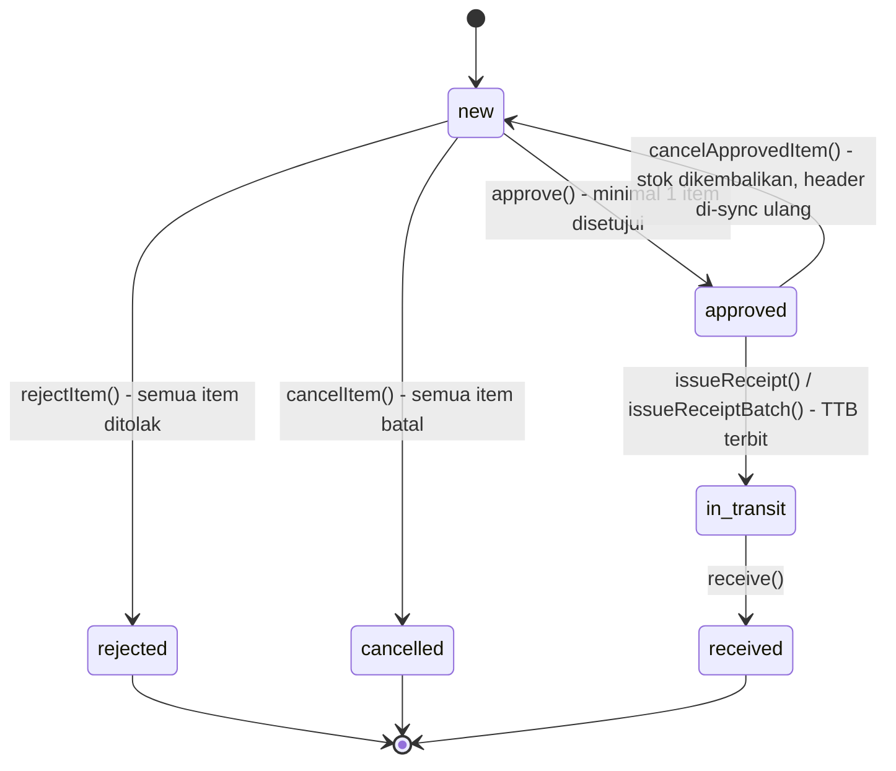
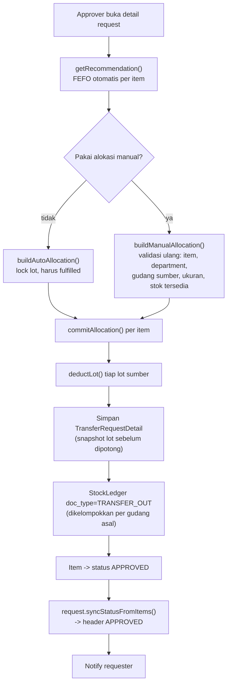
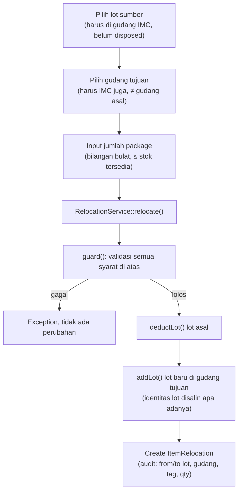
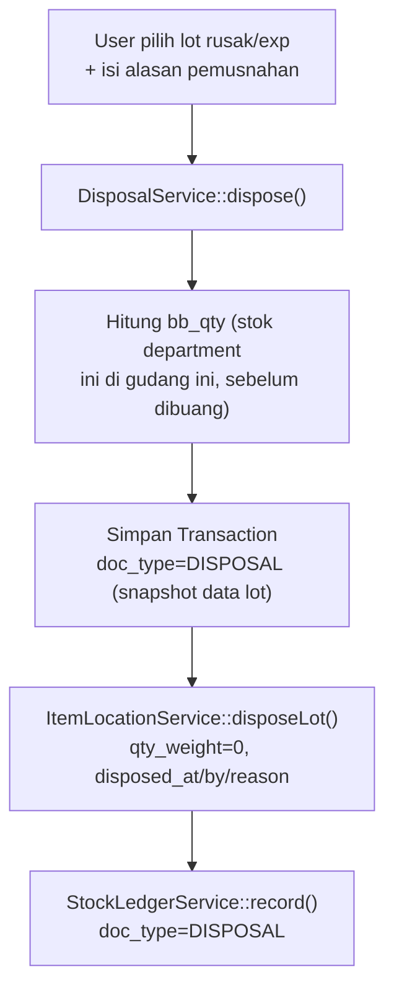
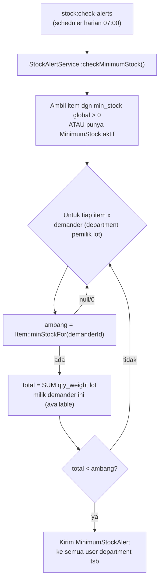
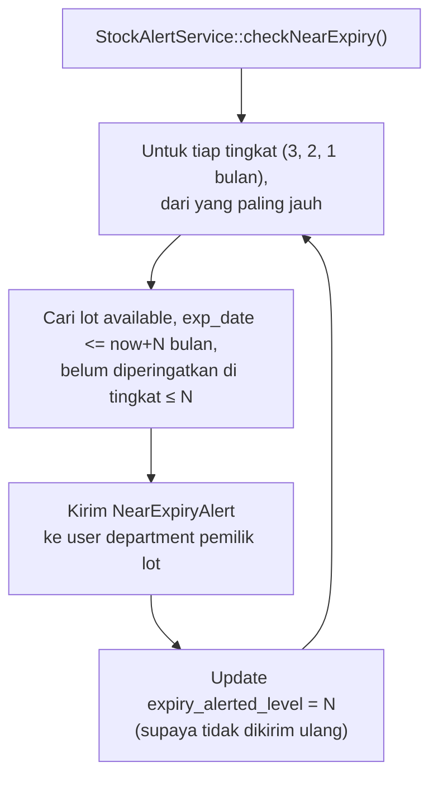

# Finish Oil System — Dokumentasi Project

Sistem manajemen inventori/gudang untuk pengelolaan **Finish Oil** — mulai dari penerimaan barang dari vendor, penyimpanan lot di gudang, permintaan & transfer antar gudang, pemakaian (konsumsi), penyesuaian stok, relokasi, hingga pemusnahan (disposal) barang kedaluwarsa. Dibangun dengan **Laravel 10**.

## Daftar Isi

1. [Ringkasan & Domain Bisnis](#1-ringkasan--domain-bisnis)
2. [Tech Stack](#2-tech-stack)
3. [Arsitektur](#3-arsitektur)
4. [Struktur Direktori](#4-struktur-direktori)
5. [Model Data & Relasi](#5-model-data--relasi)
6. [Modul Fungsional](#6-modul-fungsional)
7. [Hak Akses (Roles & Permissions)](#7-hak-akses-roles--permissions)
8. [Alur Bisnis Utama](#8-alur-bisnis-utama)
9. [Notifikasi & Job Terjadwal](#9-notifikasi--job-terjadwal)
10. [Routing](#10-routing)
11. [Instalasi & Setup Lokal](#11-instalasi--setup-lokal)
12. [Testing](#12-testing)

---

## 1. Ringkasan & Domain Bisnis

Aplikasi ini mengelola aliran stok oli antara satu **gudang pusat (department IMC — Inventory Material Control)** dan beberapa **gudang department** pemakai. Konsep intinya:

- **Item** — master barang (kode, deskripsi, satuan, kelas GL, batas stok minimum).
- **ItemLocation** — sebuah **lot** fisik barang di gudang tertentu (nomor lot vendor/penerimaan, tanggal produksi/kedaluwarsa, berat awal & sisa, ukuran kemasan). Ini adalah unit stok yang sesungguhnya dilacak, bukan `Item` secara langsung.
- **Transaction** — pencatatan transaksi manual: `PORC` (penerimaan dari vendor), `CONS` (pemakaian), `ADJ` (koreksi), `DISPOSAL` (pemusnahan).
- **TransferRequest** — permintaan pengiriman barang dari gudang IMC ke gudang department, dengan alur approval, pencetakan surat jalan (TTB), dan penerimaan barang.
- **ItemRelocation** — pemindahan lot antar gudang di lingkungan IMC (bukan proses transfer request formal).
- **StockLedger** — kartu stok / buku besar mutasi stok per item per gudang (in/out/saldo awal/saldo akhir) untuk pelaporan.

Aturan bisnis kunci yang tertanam di kode (lihat komentar service/model):

- **1 user = 1 role.**
- **PORC** (penerimaan) hanya sah di gudang IMC; **CONS** dan **ADJ** hanya sah di gudang department — ditegakkan oleh `guardZone()` di `TransactionService`, bukan sekadar oleh permission.
- Alokasi stok keluar memakai prinsip **FEFO** (First-Expired-First-Out) — lihat `ItemLocation::scopeFefo()`.
- Stok department tidak boleh diambil oleh department lain (`ItemLocation::scopeOwnedBy()`).
- Transfer memindahkan **package utuh**, ukuran kemasan sumber & tujuan harus identik.
- Lot yang sudah termutasi (transfer/CONS/ADJ) tidak boleh diedit qty PORC-nya lagi — koreksi harus lewat ADJ.

---

## 2. Tech Stack

| Layer                 | Teknologi                                                              |
| --------------------- | ---------------------------------------------------------------------- |
| Backend framework     | Laravel 10 (PHP ^8.1)                                                  |
| Autentikasi           | Laravel Breeze + Laravel Sanctum                                       |
| Otorisasi             | `spatie/laravel-permission` (roles & permissions berbasis Gate `can:`) |
| Datatable server-side | `yajra/laravel-datatables-oracle`                                      |
| PDF                   | `barryvdh/laravel-dompdf` (surat jalan / TTB)                          |
| Frontend              | Blade + Tailwind CSS + Alpine.js, dibundel via Vite                    |
| Database              | MySQL (`dev_finish_oil_system`)                                        |
| Testing               | PHPUnit 10                                                             |
| Dev tools             | Laravel Debugbar, Laravel Sail, Pint                                   |

---

## 3. Arsitektur

Project mengikuti pola **Controller → Service → Repository**:

```
HTTP Request
   │
   ▼
Controller (app/Http/Controllers)   — validasi input, otorisasi (Gate `can:`), memanggil Service
   │
   ▼
Service (app/Services)              — logika bisnis, aturan domain, transaksi DB
   │
   ▼
Repository (app/Repositories)       — akses data (Eloquent), lewat Interface untuk dependency injection
   │
   ▼
Model (app/Models)                  — Eloquent ORM, relasi, scope, accessor
```

- `app/Repositories/Interfaces` mendefinisikan kontrak, `app/Repositories/Eloquents` berisi implementasi Eloquent-nya — di-bind lewat Service Provider agar Service tidak bergantung langsung pada Eloquent.
- `app/Services/Dto` — Data Transfer Object (mis. hasil alokasi package pada `PackageAllocator`).
- `app/Services/Interfaces` — kontrak service.
- Logika alokasi lot yang kompleks (pilih lot mana yang dipakai berdasarkan FEFO/ukuran kemasan/berat) dipisah ke `PackageAllocator` agar dapat dipakai ulang oleh beberapa service (`ItemLocationService`, `TransferRequestService`, `TransactionService`).

---

## 4. Struktur Direktori

```
app/
├── Console/
│   ├── Commands/CheckStockAlerts.php     # command artisan: cek stok minimum & near-expiry
│   └── Kernel.php                        # jadwal: stock:check-alerts tiap hari 07:00
├── Http/
│   ├── Controllers/                      # 1 controller per modul (lihat bab 6)
│   ├── Middleware/
│   └── Requests/                         # Form Request validation
├── Models/                               # Eloquent models (lihat bab 5)
├── Notifications/                        # notifikasi database (bell icon)
├── Policies/                             # (kosong — otorisasi via permission Gate, bukan Policy class)
├── Providers/
├── Repositories/
│   ├── Interfaces/
│   └── Eloquents/
├── Services/
│   ├── Dto/
│   ├── Interfaces/
│   └── *.php                             # logika bisnis inti (lihat bab 6)
└── View/Components/

database/
├── migrations/
├── seeders/                              # Role/Permission, Department, Warehouse, Item awal
└── factories/

resources/views/
├── layouts/                              # app.blade.php, navbar, sidebar, template
├── components/                           # komponen Blade reusable (modal, button, input, dll)
├── pages/                                # 1 folder per modul: departments, items, item_locations,
│                                          #   notifications, relocations, reports, roles,
│                                          #   transactions, transfer_requests, users, warehouses
├── pdf/                                  # template cetak (surat jalan / tanda terima barang)
└── auth/, profile/

routes/
├── web.php                               # seluruh route aplikasi (auth-protected)
└── auth.php                              # route Breeze (login/register/dsb.)
```

---

## 5. Model Data & Relasi

| Model                   | Tabel                      | Deskripsi                                                                                                                                                                                                                             |
| ----------------------- | -------------------------- | ------------------------------------------------------------------------------------------------------------------------------------------------------------------------------------------------------------------------------------- |
| `Department`            | `departments`              | Unit organisasi (mis. `IMC` = gudang pusat). Punya banyak `Warehouse` dan `User`.                                                                                                                                                     |
| `Warehouse`             | `warehouses`               | Gudang fisik, milik satu `Department`.                                                                                                                                                                                                |
| `Item`                  | `items`                    | Master barang. `min_stock` menentukan apakah item dipantau untuk alert stok minimum.                                                                                                                                                  |
| `ItemLocation`          | `item_locations`           | **Lot** stok fisik: item + warehouse + demander (department pemilik) + data lot (vendor lot, receiving lot, tanggal produksi/exp, berat awal/sisa, ukuran kemasan). Bisa "dibuang" (`disposed_at`, `disposed_by`, `disposal_reason`). |
| `ItemRelocation`        | `item_relocations`         | Riwayat pemindahan lot antar gudang IMC (bukan transfer request formal).                                                                                                                                                              |
| `Transaction`           | `transactions`             | Transaksi manual: `PORC`, `CONS`, `ADJ`, `DISPOSAL`. Menyimpan snapshot data item & lot pada saat transaksi. Mendukung edit khusus PORC dengan audit (`edited_at`, `edited_by`, `edit_reason`).                                       |
| `StockLedger`           | `stock_ledger`             | Kartu stok: saldo awal/akhir per item/warehouse/tanggal, dengan `doc_type` (PORC/CONS/ADJ/DISPOSAL/TRANSFER_IN/TRANSFER_OUT) dan referensi polymorphic (`ref_type` + `ref_id`) ke sumber mutasi.                                      |
| `TransferRequest`       | `transfer_requests`        | Header permintaan transfer dari IMC ke gudang department. Status: `new → approved → in_transit → received`, cabang `rejected`/`cancelled`.                                                                                            |
| `TransferRequestItem`   | `transfer_request_items`   | Baris item dalam satu transfer request, dengan status sendiri (`new/approved/rejected/cancelled`).                                                                                                                                    |
| `TransferRequestDetail` | `transfer_request_details` | Detail alokasi per lot untuk satu item transfer (lot sumber, qty diambil, lot tujuan hasil terima).                                                                                                                                   |
| `TransferApprover`      | `transfer_approvers`       | Daftar user yang berwenang approve transfer request.                                                                                                                                                                                  |
| `ReceiptOfGoods`        | `receipt_of_goods`         | Tanda Terima Barang (TTB) — nomor surat auto-generate format `NNNN/IMC/<bulan-romawi>/<tahun>`.                                                                                                                                       |
| `MinimumStock`          | `minimum_stocks`           | Ambang stok minimum **khusus per department**, override nilai global `items.min_stock`. Dicek lewat `Item::minStockFor($departmentId)`: pakai baris aktif di sini kalau ada, jatuh balik ke `min_stock` global kalau tidak.           |
| `User`                  | `users`                    | User aplikasi. Punya `department_id`, flag `can_issue_receipt` (izin terbitkan TTB di luar sistem permission biasa), dan role via Spatie (`HasRoles`).                                                                                |

### Diagram relasi (disederhanakan)

```
Department 1───* Warehouse 1───* ItemLocation *───1 Item 1───* MinimumStock *───1 Department
    │                                  │
    │                                  ├──* Transaction
    *                                  └──* ItemRelocation (from/to)
  User

TransferRequest 1───* TransferRequestItem 1───* TransferRequestDetail ──> ItemLocation (source & dest)
       │
       └──1 ReceiptOfGoods
```

---

## 6. Modul Fungsional

| Modul                       | Controller                  | Service                                  | Ringkasan                                                                                                                                                       |
| --------------------------- | --------------------------- | ---------------------------------------- | --------------------------------------------------------------------------------------------------------------------------------------------------------------- |
| Dashboard                   | `DashboardController`       | —                                        | Ringkasan/statistik utama.                                                                                                                                      |
| Department                  | `DepartmentController`      | `DepartmentService`                      | CRUD department.                                                                                                                                                |
| Warehouse                   | `WarehouseController`       | `WarehouseService`                       | CRUD gudang, termasuk lookup ID gudang per kode department.                                                                                                     |
| Item Master                 | `ItemController`            | `ItemService`                            | CRUD master barang + halaman detail item.                                                                                                                       |
| Minimum Stock               | `MinimumStockController`    | (langsung ke model `MinimumStock`)       | CRUD ambang stok minimum **per department** (override `items.min_stock` global). IMC tidak punya baris karena tidak menyimpan stok sendiri.                     |
| Item Location (Stok Gudang) | `ItemLocationController`    | `ItemLocationService`, `DisposalService` | Lihat/edit/hapus lot stok, hitung total stok (per item/warehouse/department/demander), rekomendasi lot near-expiry, ringkasan stok per gudang, **dispose** lot. |
| Transaksi (PORC/CONS/ADJ)   | `TransactionController`     | `TransactionService`, `PackageAllocator` | Input transaksi batch, edit/hapus PORC dengan alasan, ambil data stok & lot via AJAX untuk form CONS/ADJ.                                                       |
| Transfer Request            | `TransferRequestController` | `TransferRequestService`                 | Buat permintaan, approve/reject/cancel, cetak surat jalan (batch), terima barang, terbitkan/cetak Tanda Terima Barang.                                          |
| Relokasi                    | `RelocationController`      | `RelocationService`                      | Pindahkan lot antar gudang IMC.                                                                                                                                 |
| User Management             | `UserController`            | `UserService`                            | CRUD user + assign role.                                                                                                                                        |
| Role & Permission           | `RoleController`            | (Spatie)                                 | CRUD role beserta permission yang dicentang.                                                                                                                    |
| Laporan                     | `ReportController`          | `StockLedgerService`                     | Kartu stok bulanan (umum & versi staff/department).                                                                                                             |
| Notifikasi                  | `NotificationController`    | —                                        | Daftar notifikasi, ambil notifikasi terbaru (untuk bell icon), tandai dibaca.                                                                                   |

---

## 7. Hak Akses (Roles & Permissions)

Otorisasi memakai **Spatie Laravel-Permission**, dicek langsung di route lewat middleware `can:<permission>` (bukan Policy class terpisah). Permission dipecah granular per aksi (`view`/`create`/`update`/`delete`/aksi khusus) agar bisa dicentang satu per satu di form Role.

Role bawaan (`RolesAndPermissionSeeder`):

| Role        | Cakupan                                                                                                                                                                                                                                                  |
| ----------- | -------------------------------------------------------------------------------------------------------------------------------------------------------------------------------------------------------------------------------------------------------- |
| **admin**   | Akses penuh ke semua permission.                                                                                                                                                                                                                         |
| **imc**     | Pengelola gudang pusat: kelola stok/lot, PORC penuh (create/update/delete), lihat transaksi department (tanpa create), approve/reject transfer request, lihat laporan. **Tidak** bisa CONS/ADJ (ditolak oleh `guardZone()` karena berada di gudang IMC). |
| **manager** | Read-only: lihat item & laporan.                                                                                                                                                                                                                         |
| **staff**   | Operasional gudang department: lihat item, CONS & ADJ (create+view), buat/cancel/receive transfer request. **Tidak** bisa PORC.                                                                                                                          |

Catatan dari `RolesAndPermissionSeeder`:

- Permission `minimum-stocks.*` dan `relocations.*` saat ini **hanya diberikan ke role admin** secara default (`imc`/`manager`/`staff` tidak di-sync permission ini). Admin dapat mencentang ulang lewat halaman Role kalau role lain perlu akses.
- Approve/reject transfer request tidak murni ditentukan oleh permission — `TransferRequestService::guardApprover()` tetap mensyaratkan user terdaftar di tabel `transfer_approvers`, meski usernya sudah punya permission `transfer-requests.approve`.
- Cancel item yang **sudah** di-approve (`cancelApprovedItem`) memakai permission `transfer-requests.approve` yang sama (bukan `transfer-requests.cancel`), karena butuh wewenang approver untuk mengembalikan stok.

Aturan tambahan di luar permission: kolom `users.can_issue_receipt` mengontrol siapa yang boleh menerbitkan Tanda Terima Barang, dicek langsung di service — bukan lewat sistem permission Spatie.

---

## 8. Alur Bisnis Utama

Setiap sub-bab berikut memuat penjelasan langkah dan **diagram alur proses** dari fungsi utamanya (method service yang benar-benar dipanggil, bukan sekadar ringkasan).

### 8.1 Penerimaan Barang (PORC)

1. Staff IMC input **PORC** (bisa banyak baris sekaligus/batch) lewat `TransactionController::storePorc` → `TransactionService::createBatch`.
2. Tiap baris diproses dalam satu `DB::transaction`; kalau baris ke-N gagal, seluruh batch dibatalkan (rollback), bukan hanya baris tersebut.
3. Berat (`trans_qty`) **dihitung**, bukan diinput langsung: `qty_perpackage × qty_package` (`resolvePorcWeight`).
4. `receiving_lot` digenerate sekali (`generateReceivingLot`, format `TFCO-yymmddNNN`) lalu dipakai untuk membuat `ItemLocation` (lot baru) via `ItemLocationService::addLot`.
5. Dicatat ke `StockLedger` sebagai `doc_type = PORC`.
6. PORC yang belum "tersentuh" (lot belum ada mutasi keluar, `lot->isTouched() === false`) masih bisa diedit (`updatePorc`) atau dihapus (`delete`); begitu lot sudah termutasi, qty ditutup untuk edit/hapus — koreksi wajib lewat ADJ.



### 8.2 Pemakaian (CONS) & Penyesuaian (ADJ)

1. Hanya sah di gudang **department** (bukan IMC) — `TransactionService::guardZone()` menolak sebaliknya.
2. **CONS**: user hanya input total kg yang dipakai; sistem mengalokasikan lot secara otomatis lewat FEFO (`ItemLocationService::allocateForCons` → `PackageAllocator::allocateByWeight`), boleh memotong lintas beberapa lot dan lintas ukuran kemasan.
3. **ADJ**: user memilih **satu lot spesifik** (via AJAX `get-lots`) dan `adj_type` (`IN`/`OUT`); tidak ada FEFO otomatis karena koreksi menyasar lot tertentu.
4. Validasi stok berbeda: CONS/PORC divalidasi terhadap total stok gudang di awal (`bb_qty`); ADJ divalidasi belakangan, langsung terhadap lot yang dipilih (supaya pesan error relevan, bukan terhadap total gudang).
5. Hasil akhir dicatat ke `StockLedger` (`doc_type = CONS` atau `ADJ`, arah `in_qty`/`out_qty` sesuai `adj_type`).



### 8.3 Transfer Request (IMC → Department)

Status header: `new → approved → in_transit → received`, dengan cabang `rejected` (oleh IMC, semua item ditolak) dan `cancelled` (oleh requester/approver, semua item batal). Status header disinkron otomatis dari status item-itemnya lewat `TransferRequest::syncStatusFromItems()` — **kecuali** setelah status `in_transit`/`received`, saat itu header tidak lagi mengikuti item.



**a. Create** — Staff department membuat request (`TransferRequestService::create`). Ukuran & jumlah kemasan divalidasi terhadap stok IMC yang **benar-benar tersedia** (`guardRequestable`): package fisik dikurangi package yang sudah "dipesan" (reserved) oleh request lain yang masih pending, supaya beberapa department tidak sama-sama mengklaim stok yang sama.

**b. Approve** — Approver (harus terdaftar di `transfer_approvers`, dicek `guardApprover`) menyetujui item yang masih pending. Alokasi lot memakai rekomendasi FEFO otomatis (`getRecommendation` → `buildAutoAllocation`) atau alokasi manual per lot (`buildManualAllocation`, divalidasi ulang dari nol — data form tidak dipercaya). Package harus utuh (tidak boleh pecahan) karena kemasan di IMC tidak boleh dibuka.



**c. Reject / Cancel** —

- `rejectItem` (IMC, item masih `new`, wajib alasan): tidak ada efek stok.
- `cancelItem` (requester sendiri, item masih `new`): tidak ada efek stok.
- `cancelApprovedItem` (approver, item sudah `approved`, dan **belum** ada `ReceiptOfGoods`): mengembalikan `qty_weight` ke tiap lot asal sesuai `TransferRequestDetail`, menghapus detail & `StockLedger TRANSFER_OUT` terkait (dianggap tidak pernah terjadi), lalu status item → `cancelled`.

**d. Cetak Surat Jalan / Terbitkan TTB** — `issueReceipt` (satu request) atau `issueReceiptBatch` (banyak sekaligus, divalidasi semua dulu sebelum ada nomor yang terbit — supaya tidak ada nomor resmi "bocor" untuk request yang gagal). Nomor surat: `generateLetterNumber()` → format `NNNN/IMC/<romawi-bulan>/<tahun>`, reset tiap tahun, diurutkan dari nomor (bukan tanggal, karena tanggal boleh di-backdate). Ini yang mengubah status `approved → in_transit`; cetak ulang berikutnya (`markPrinted`) hanya menambah `print_count`, tidak mengubah apa pun lagi.

**e. Terima Barang** — Department tujuan (harus cocok `department_id` request, kecuali admin — `guardReceiver`) menerima (`receive`). Untuk tiap `TransferRequestDetail`, dibuat `ItemLocation` (lot) baru di gudang tujuan lewat `addLot`, dicatat `dest_item_location_id`, dan `StockLedger` mencatat `TRANSFER_IN`. Status → `received`.

### 8.4 Relokasi

Pemindahan lot antar gudang **di lingkungan IMC saja** (dua-duanya harus IMC), tanpa proses transfer request formal — karena barang tidak berpindah kepemilikan/keluar dari IMC. Karena itu **tidak** dicatat ke `StockLedger` (saldo total tidak berubah), melainkan ke tabel audit `item_relocations`.



### 8.5 Disposal (Pemusnahan)

Lot yang rusak/kedaluwarsa dibuang lewat `ItemLocationController::dispose` → `DisposalService::dispose`. Seluruh lot dibuang sekaligus (kalau hanya sebagian rusak, kurangi dulu lewat Adjustment). Baris lot **tidak dihapus** — hanya ditandai — supaya jejak audit tetap ada dan detail transfer lama masih bisa merujuknya.



### 8.6 Alert Stok Minimum & Near-Expiry (job terjadwal)

Dijalankan oleh command `stock:check-alerts` (lihat [Bab 9](#9-notifikasi--job-terjadwal)), keduanya lewat `StockAlertService`.

**a. Stok Minimum** — ambang diambil per department lewat `Item::minStockFor($departmentId)`: pakai baris `MinimumStock` yang aktif untuk department tersebut kalau ada, kalau tidak jatuh balik ke `items.min_stock` global. Stok dihitung dari **kepemilikan** (`demander_id`), bukan lokasi fisik — barang yang masih dititipkan di gudang IMC tetap terhitung milik department pemesan.



**b. Near-Expiry** — peringatan bertingkat 3, 2, dan 1 bulan menjelang `exp_date` (`config('notification.expiry_alert_months')`). Tiap lot hanya diperingatkan **sekali per tingkat**, ditandai lewat `expiry_alerted_level`, supaya scheduler harian tidak mengirim notifikasi yang sama berulang.



---

## 9. Notifikasi & Job Terjadwal

- **`stock:check-alerts`** (`CheckStockAlerts` command) dijadwalkan tiap hari **07:00** (`withoutOverlapping`), menjalankan `StockAlertService` — lihat diagram alur di [8.6](#86-alert-stok-minimum--near-expiry-job-terjadwal):
    - `checkMinimumStock()` — kirim `MinimumStockAlert` untuk item yang stoknya (per department pemilik) di bawah ambang dari `Item::minStockFor()` (override `MinimumStock` per department, atau `items.min_stock` global).
    - `checkNearExpiry()` — kirim `NearExpiryAlert` bertingkat (3/2/1 bulan) untuk lot yang mendekati tanggal kedaluwarsa, masing-masing tingkat dikirim sekali per lot (`expiry_alerted_level`).
- **`TransferRequestNotification`** — dikirim pada event-event alur transfer request (approve/reject/dsb.) ke pihak terkait.
- Notifikasi tersimpan di tabel `notifications` (database notification Laravel), ditampilkan lewat bell icon (`notification-bell` component) dan halaman `notifications.index`.

---

## 10. Routing

Semua route didefinisikan di `routes/web.php`, dikelompokkan per modul dan dilindungi middleware `auth` + `can:<permission>` granular per aksi. Ringkasan grup:

- `/dashboard` (+ `dashboard/transfer-summary`, khusus role `imc`/`admin`, dipakai rekap transfer di dashboard)
- `/profile` (Breeze)
- `/departments`, `/warehouses`, `/items`
- `/minimum-stocks` (CRUD ambang stok minimum per department)
- `/item-locations` (+ `dispose`)
- `/transactions` (+ `supply-oil` untuk PORC, `pemakaian` untuk CONS, `adjustment` untuk ADJ, `get-stock`, `get-lots` untuk AJAX)
- `/transfer-requests` (+ `create`, `package-sizes`, `cetak-batch`, `approve`, `reject`, `cancel`, `cancel-approved`, `receive`, `receipt` untuk TTB)
- `/users`, `/roles`
- `/reports`
- `/notifications` (+ `latest`, `read-all`, `{id}/read`)
- `/relocations`

Catatan penting dari komentar kode:

- Route statis (`transfer-requests/create`) **harus** didaftarkan sebelum route dinamis `{id}` agar tidak salah tertangkap.
- Endpoint AJAX (`get-stock`, `get-lots`) dijaga permission spesifik, bukan sekadar `auth`, agar user tidak bisa mengintip stok gudang department lain dengan menebak `warehouse_id`.

---

## 11. Instalasi & Setup Lokal

```bash
# 1. Install dependency PHP & JS
composer install
npm install

# 2. Environment
cp .env.example .env
php artisan key:generate
# set DB_DATABASE, DB_USERNAME, DB_PASSWORD sesuai environment lokal (MySQL)

# 3. Migrasi & seeding awal (role/permission, department, warehouse, item, admin user)
php artisan migrate --seed

# 4. Jalankan
php artisan serve
npm run dev        # asset development (Vite)
```

Akun admin awal dari seeder: `admin@tifico.co.id` / password `1` (department: IMC) — **wajib diganti** sebelum digunakan di lingkungan production.

Untuk menjalankan job stok terjadwal secara lokal:

```bash
php artisan schedule:work
# atau langsung:
php artisan stock:check-alerts
```

---

## 12. Testing

```bash
php artisan test
# atau
./vendor/bin/phpunit
```

Konfigurasi di `phpunit.xml`; test disimpan di `tests/Feature` dan `tests/Unit`.
